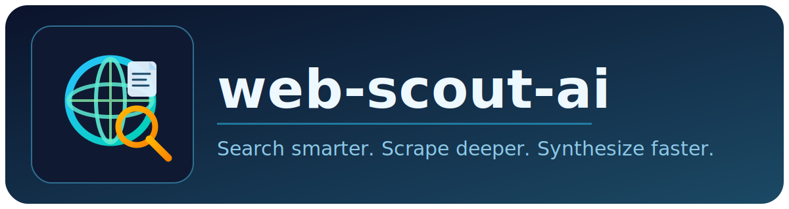

<p align="center">
  
</p>

<p align="center">
  <a href="https://pypi.org/project/web-scout-ai/"></a>
  <a href="https://pypi.org/project/web-scout-ai/"></a>
  <a href="https://pypi.org/project/web-scout-ai/"></a>
  <a href="LICENSE"></a>
</p>

<p align="center">
  <strong>The missing middle ground between basic search APIs and heavyweight deep research agents.</strong><br />
  One async call that finds the right URLs, reads real pages and documents, and returns a grounded synthesis with sources.
</p>

## TL;DR

`web-scout-ai` is for teams that want better-than-snippets web research without the latency and cost profile of full deep-research stacks.

You get:
- Search -> scrape -> evaluate -> iterate -> synthesize in one deterministic pipeline
- Support for HTML, JS-rendered pages, PDFs, DOCX, PPTX, XLSX
- Structured output that drops directly into agent workflows
- Provider flexibility through LiteLLM (OpenAI, Anthropic, Gemini, Mistral, Groq, local, and more)

## Why People Switch To web-scout-ai

| Option | Typical output | Pain point |
| --- | --- | --- |
| Search API only | snippets and links | not enough context to answer reliably |
| Single-page markdown tools | one page at a time | no discovery loop, no multi-source synthesis |
| Heavy deep-research agents | long reports | slower, more expensive, often overkill |
| `web-scout-ai` | sourced synthesis from real content | built for practical speed + depth balance |

## What Makes It Hook

### 1) It reads sources, not snippets
The pipeline extracts substantial query-relevant content from each source, then synthesizes across them.

### 2) It handles real documents out of the box
- Static HTML via fast HTTP
- JS pages via Playwright
- PDF, DOCX, PPTX, XLSX via `docling`
- Scanned PDFs via vision-model fallback

### 3) It closes coverage gaps automatically
If first-pass sources are incomplete, it checks the existing backlog first, then runs targeted follow-up searches only when needed.

### 4) It is agent-native by design
One async function (`run_web_research`), one typed result (`WebResearchResult`), zero framework lock-in.

## Install In 30 Seconds

```bash
pip install web-scout-ai
web-scout-setup
```

`web-scout-setup` installs Chromium required for JS-rendered pages.

## First Run

```python
import asyncio
from web_scout import run_web_research

async def main():
    result = await run_web_research(
        query="What are the main threats to coral reefs worldwide?",
        models={
            "web_researcher": "openai/gpt-5.4-mini",
            "content_extractor": "gemini/gemini-3-flash-preview",
        },
    )

    print(result.synthesis)
    print("Sources:")
    for s in result.scraped:
        print(f"- {s.title}: {s.url}")

asyncio.run(main())
```

## API At A Glance

```python
result = await run_web_research(
    query="latest IPCC findings on sea level rise",
    models={
        "web_researcher": "openai/gpt-5.4-mini",
        "content_extractor": "gemini/gemini-3-flash-preview",
    },
    search_backend="duckduckgo",       # or "serper"
    research_depth="standard",         # or "deep"
    include_domains=["ipcc.ch"],       # optional
    direct_url=None,                     # optional
    domain_expertise="climate science",# optional
)
```

## Configuration

### Models

Model ids follow [LiteLLM provider naming](https://docs.litellm.ai/docs/providers):

```python
models = {
    # Required
    "web_researcher": "openai/gpt-5.4-mini",
    "content_extractor": "gemini/gemini-3-flash-preview",

    # Optional step-specific overrides (default: web_researcher)
    "query_generator": "openai/gpt-5.4-mini",
    "coverage_evaluator": "openai/gpt-5.4-mini",
    "synthesiser": "openai/gpt-5.4-mini",

    # Optional fallback for scanned PDFs / empty JS pages
    "vision_fallback": "gemini/gemini-3-flash-preview",
}
```

### Environment variables

```bash
# Search backend (optional if using DuckDuckGo)
export SERPER_API_KEY="..."

# LLM providers (set what you use)
export OPENAI_API_KEY="..."
export ANTHROPIC_API_KEY="..."
export GEMINI_API_KEY="..."
export MISTRAL_API_KEY="..."
export GROQ_API_KEY="..."
```

### Research modes

```python
# 1) Open web research (default)
await run_web_research(query="latest IPCC findings on sea level rise", models=models)

# 2) Domain-restricted
await run_web_research(
    query="endemic species conservation programs",
    models=models,
    include_domains=["iucn.org", "wwf.org"],
)

# 3) Direct URL extraction (skip search)
await run_web_research(
    query="key findings from this report",
    models=models,
    direct_url="https://example.org/biodiversity-report.pdf",
)

# 4) Direct URL list-page deepening
await run_web_research(
    query="sustainable land management technologies in Kenya",
    models=models,
    direct_url="https://wocat.net/en/database/list/?type=technology&country=ke",
)
```

### Search backends

```python
# Default: Serper (requires SERPER_API_KEY)
await run_web_research(query=..., models=..., search_backend="serper")

# Free: DuckDuckGo (no API key)
await run_web_research(query=..., models=..., search_backend="duckduckgo")
```

### Research depth

```python
# Standard (default): usually up to ~10 sources
await run_web_research(query=..., models=..., research_depth="standard")

# Deep: usually up to ~28 sources
await run_web_research(query=..., models=..., research_depth="deep")
```

| Parameter | Standard | Deep |
| --- | --- | --- |
| Max iterations | 2 | 3 |
| Search queries (first round) | 3 | 5 |
| Search queries (follow-up) | 2 | 4 |
| URLs scraped (first round) | 6 | 12 |
| URLs scraped (follow-up) | 4 | 8 |

## Pipeline Overview

Editable diagram: [`pipeline-diagram.excalidraw`](pipeline-diagram.excalidraw)

```
Query
 |
 +- Generate search queries (LLM)
 +- Search web (Serper or DuckDuckGo)
 +- Select best URLs
 +- Scrape and extract in parallel
 |   +- Static HTML
 |   +- JS/SPA via Playwright
 |   +- PDF/DOCX/PPTX/XLSX via docling
 |   +- Scanned PDFs via vision fallback
 +- Evaluate coverage (LLM)
 |   +- Scrape promising backlog URLs
 |   +- Or generate targeted follow-up queries
 +- Synthesize findings (LLM)
 |
 +- WebResearchResult
```

## Use As An Agent Tool

```python
from agents import Agent, function_tool
from web_scout import run_web_research

@function_tool
async def research(query: str) -> str:
    result = await run_web_research(
        query=query,
        models={
            "web_researcher": "openai/gpt-5.4-mini",
            "content_extractor": "gemini/gemini-3-flash-preview",
        },
        search_backend="duckduckgo",
    )
    sources = "\n".join(f"- {s.url}" for s in result.scraped)
    return f"{result.synthesis}\n\nSources:\n{sources}"

agent = Agent(
    name="researcher",
    model="gpt-5.4-mini",
    tools=[research],
    instructions="Use the research tool to answer with up-to-date web sources.",
)
```

## Output Schema

```python
class WebResearchResult(BaseModel):
    synthesis: str
    scraped: list[UrlEntry]
    scrape_failed: list[UrlEntry]
    snippet_only: list[UrlEntry]
    queries: list[SearchQuery]
```

`UrlEntry` contains `url`, `title`, and `content`.
`SearchQuery` contains `query`, `num_results_returned`, and `domains_restricted`.

## Brand Assets

- Full logo: [`assets/web-scout-logo.svg`](assets/web-scout-logo.svg)
- Square logo mark (avatar-safe): [`assets/web-scout-logo-mark.svg`](assets/web-scout-logo-mark.svg)
- Social card preview: [`assets/web-scout-social-card.svg`](assets/web-scout-social-card.svg)

## Requirements

- Python `>=3.10`
- API key for at least one supported LLM provider
- Optional `SERPER_API_KEY` (or use DuckDuckGo)

## License

MIT
